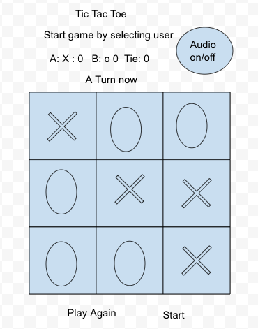
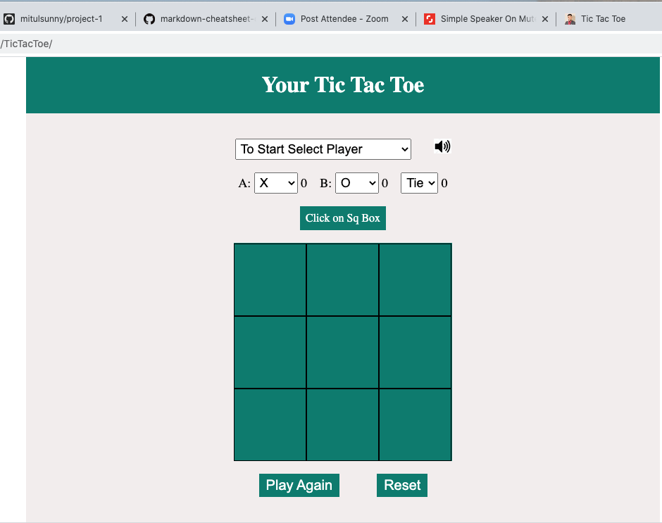
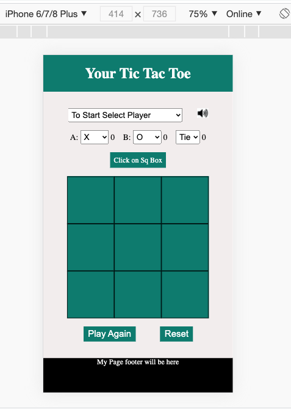
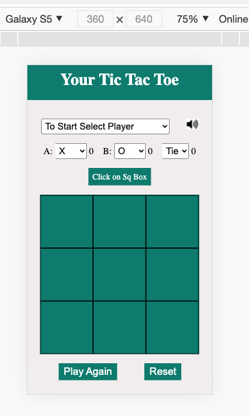

# 
Project#1: Tic Tac Toe 

## Overview: 

This is a web based game called <b>Tic Tac Toe</b>. This game is built using HTML, CSS, and Javascript. It has different feature setup that will allow user to play the game based on their interest level.   
## List of Technology
This web based application is developed by using HTML, CSS, Javascript.   

## User Stories

* As a user, I should be able to start a new tic tac toe game
* As a user, I should be able to click on a square to add X first and then O, and so on
* As a user, I should be shown a message after each turn for if I win, lose, tie or who's turn it is next
* As a user, I should not be able to click the same square twice
* As a user, I should be shown a message when I win, lose or tie
* As a user, I should not be able to continue playing once I win, lose, or tie
* As a user, I should be able to play the game again without refreshing the page
  

## Potential Extra Tic Tac Toe Features

 * Keep track of multiple game rounds with a win, lose and tie counter
 * Allow players to customize their tokens (X, O,dog pictuer, cat picture)
 * Involve Audio in your game
    * One type audio for each click
    * Second type Audio for winning
    * Third type Audio for draw
 * Two level of AI for playing against user 
 * Make your site fully responsive so that it is playable from a mobile phone
* Added animation when user win or draw by changing background color to bring the enjoyable look. 
  

 ## Additional Potential Extra Tic Tac Toe Features
 

* It has the ability to turn on/off the sound.
* Completely resetting the game without refreshing the page.
* Added favicon.ico feature to display my own picture in the title bar. Where we will be able to add companies log. 
  

## Wareframe

 Click <a href="https://docs.google.com/drawings/d/1smcYsMxWf0JbEK6ZU2w4Gp5cHjETjmAsD5_-7CBTE_k/edit">here</a>
  to find the wareframe that I have drew in google draw. 
  
  
  Image 1: Wareframe 
  

## How Did I Solve The Winner

There are four different arrays that I have managed in this app. One array I manage for keeping all the clicked index, second array I use to keep all the clicked index by user A, and the third array I use to keep all the clicked by userB. I also have another array for keeping all the different combination of idex for winning. 
Then I run nested for loop to find the winner, or draw if there is no winning index for either user A or user B, and the number of clicked is equal to the number of available boxes.  
  

## My Favorite Function

 I feel proud myself when I was able to solve medium level AI part. I try to find the specific index that will be the last click for the user to win the game and make that index ready to click by AI. That reduce the winning chance for user A. 
  If the AI has two index clicked and the third clicked will make the user winner, then the AI will select that index to win. On the other hand, if AI found ther is no winning chance on the current click, then it looks for the user A index to see if there is any combination of index  that is already clicked by the other user, and the next click will make other user winner. Then AI will click on that index to prevent the other user from winning. 
   

 ## Known Defect
 

Based on my short time testing, I found there is a problem for changing the sure at the middle of the game, I mean user can change the leve from Medium to Easy at the middle of the game, that need to fixed. 
   

 ## Next Target

I have my next target setup for fixing the existing defect. Then I will add an option to collect user name and email address to marke the user uniquely in the database, then connect each of the click array in database, that will allow two players to play the game from two different screen with each other.

   
## List of Available Feature

### Select Different Level
 This game have the feature to play different level of the game, such as <b>Play Yourself</b>, <b>Level Easy</b>, and <b>Level Medium</b>. First level of the game is called <b>Play Yourself</b>, which will allow you to play the game as a user A and user B. The <b>Level Easy</b> has <b>AI</b> setup ready to play against you, the AI has the intelegent setup where it will play everytime you have completed your round. The third leve of the game is called <b>Level Medium</b> This level also has <b>AI</b> setup ready to paly against you, but here the AI is more intelegent compare to <b>Level Easy</b>. 
 ### Auido
 There are three different types of audios are added in this game, one type of auido is added to make sound for each and every click on the game box. Another type of audio will play when either user A or user B will win the game, and a different types of audio will paly when the game is draw. 
### Audio On/Off Switch
As a user, sometime we do not want to hear any sound when we want to spend sometime on mobile or computer screen by playing game. This app has the ability to mute or unmute by clicking on the speaker icone on top right coner.
### User's Ball Selection
Sometime we want to have different reaction from our own action. This app has the ability to provide user to select either X or O, or Cat or Dog image on each of the clicked box. If user A select X automatically the user B will be selected for O, and vs. In addition, user A will be able to select Cat then user B will be selected Dog and vs. 
### Display Screen
All the action that we are doing here on our game board, the screen will display the action to give that live status of the game and provide the direction for next steps. For example: if user A click on the box, it will automatically show the message on displa screen that now is the turn for user B to click. If user A win from the game, there will be a message shown on display screen that "A winner!!" with green background color, If user B win the game, the message will shown on display screen as "B winner!!" with green backgound color. When the game is draw, the user A and user B selected box will shown with the messgae like "XO DRAW!!" with red background.    
### User Scores 
There are three different score is listed on the screen such as user A, user B, and Tie. Be default, the score is setup as Zero. All the winning, and Tie recored will be added based on the winner or Tie. 
### Play Again
Play Again is a button that will allow user to start next round of the game. This button will create the board, after each of the winning or draw session. 
### Reset
This Reset button is very powerfull, it will allow user to reset everyting to the starting point without refreshing the page.

### Highlighting Winning Line
There is a feature I have added in the app, that will highlight the row, or column, or diagonal line that three rows make the winner. If the game is draw, then all the square boxes will be red. 

### Favicon.ico
I have suffered a lot to find the 404 error that was generated when I have added audio. Although the error was not impacting any feature, but I was feeting bad when it was showing in the console. Finally I was able to find the error, and fixed it by adding favicon.ico with my own image. There is no any more 404 error for that resion, and I have added m own image that shows on title bar.  

### UI Screen On Desktop

### Iphone 6/7/8 Plus Screen On Desktop

### Samsung Galaxy S% Screen
